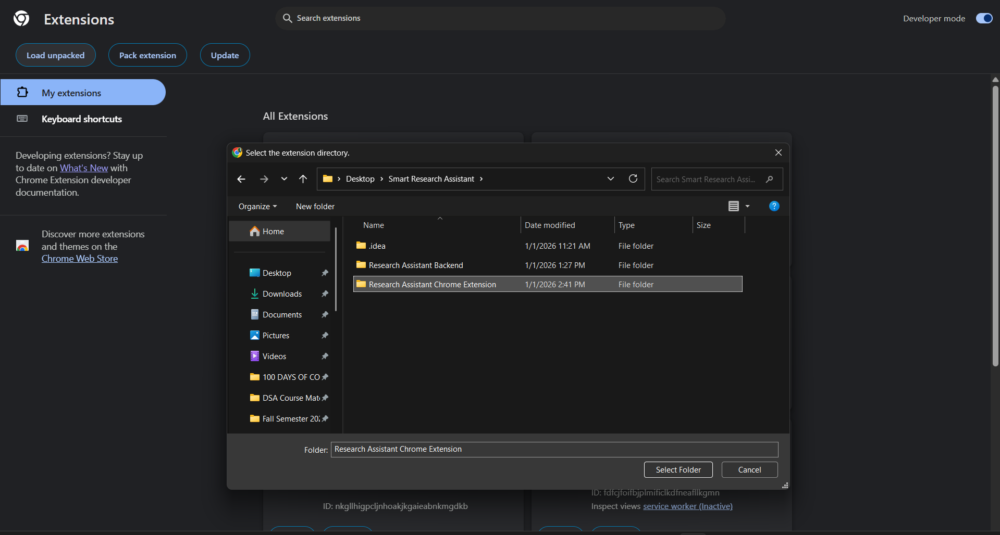
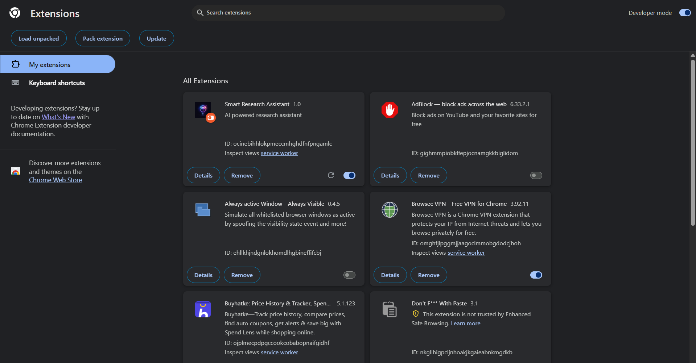
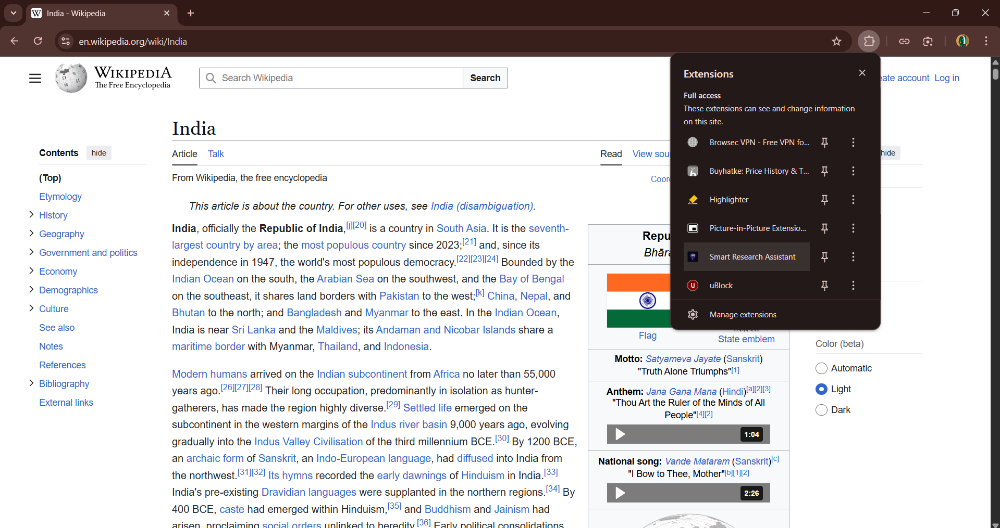
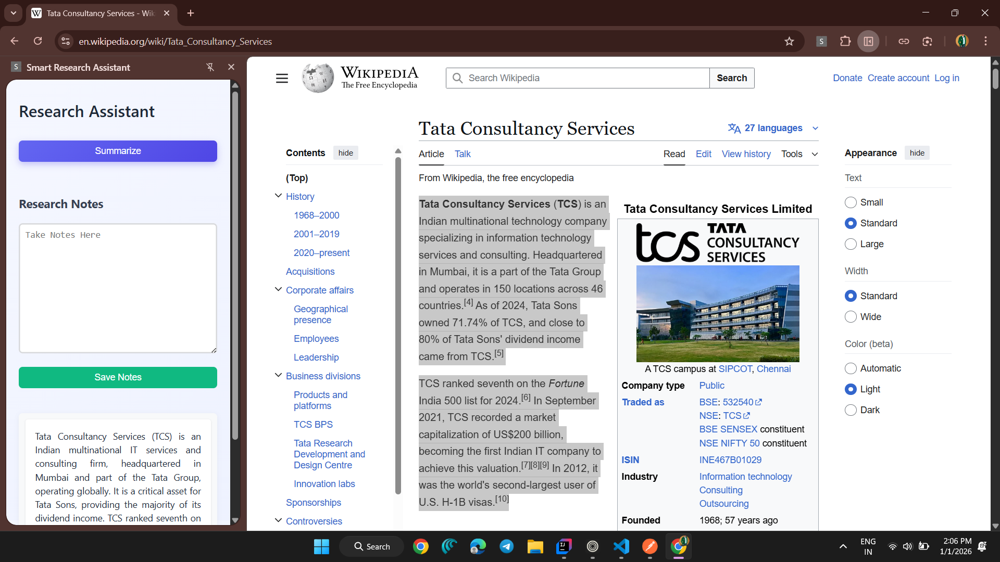

# 🧠 Smart Research Assistant – Chrome Extension

An AI-powered Chrome Extension that lets you **select any text on the web and instantly get a clean summary**, helping students and researchers read faster and work smarter.

---

## 🚀 What does it do?

Instead of copying content manually into ChatGPT or other tools:

1. Select any text on any website
2. Click **Summarize** in the side panel
3. Get an AI-generated summary instantly
4. Save your personal research notes inside the extension

---

## 🧩 System Architecture

```
Chrome Extension  →  Spring Boot API  →  Gemini AI API
```

The extension sends the selected text to a Spring Boot backend hosted on **Render**, which forwards it to **Gemini AI** and returns the summary.

---

## 🛠 Tech Stack

| Layer      | Technology                                            |
| ---------- | ----------------------------------------------------- |
| Frontend   | Chrome Extension (Manifest V3, JavaScript, HTML, CSS) |
| Backend    | Spring Boot REST API                                  |
| AI         | Gemini 2.5 Flash API                                  |
| Deployment | Docker + Render                                       |
| Storage    | Chrome Local Storage                                  |

---

## ⚙️ How to Install Locally

1. Clone the repo

   ```
   git clone https://github.com/your-username/research-assistant-chrome-extension
   ```

2. Open Chrome → `chrome://extensions/`

3. Enable **Developer Mode**

4. Click **Load Unpacked**

5. Select the extension project folder

---

## Demo

| Step                   | Screenshot                 |
| ---------------------- | -------------------------- |
| Loading the extension in chrome  |  |
| Extension Loaded in My extensions   |  |
| Accessing the extension from extensions panel  |  |
| Select text that you want to summarize and click on summarize > Result generates at the bottom    |  |

---

## 🔗 Backend Integration
You can create your own backend service and update the url in :

```
sidepanel/side_panel.js
```
This project uses the Rest API developed by me using SpringBoot which successfully deployed on Render and is listening on: 

```js
fetch("https://research-assistant-backend-6l7n.onrender.com/api/research/process", { ... })
```

---

## ✨ Features

* 🔍 Select any text on any website
* 🤖 AI powered summarization
* 📝 Save personal research notes
* ⚡ Instant results inside browser
* ☁ Cloud hosted backend

---

## 📈 Why this project matters

This project demonstrates real-world skills:

* Chrome Extension development
* Full-stack architecture
* AI integration
* Docker based deployment
* Production-grade REST APIs

---

## 🧑‍💻 Author

**Ayush Gupta**
B.Tech CSE | Full-Stack Developer
GitHub: [https://github.com/isayushgupta](https://github.com/isayushgupta)
